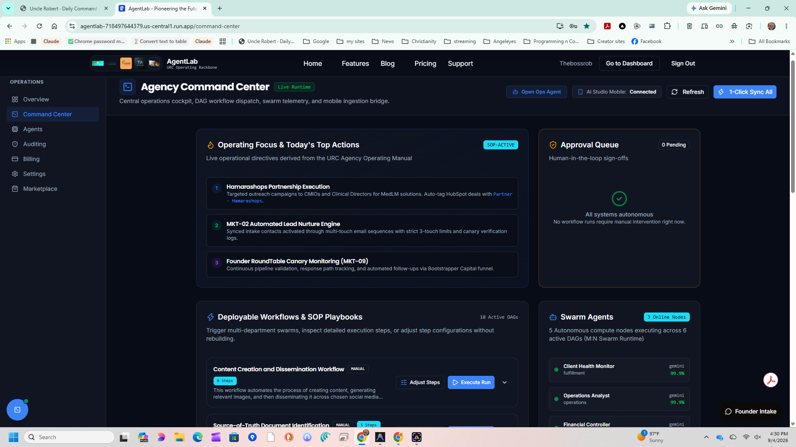
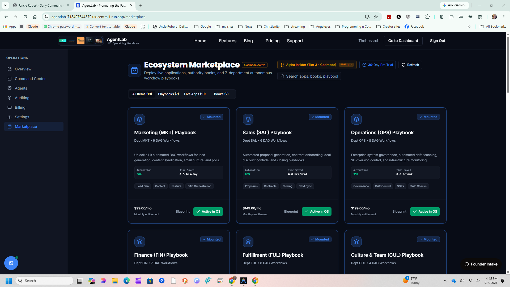

# AgentLab

> The AI-native operating system for Uncle Robert Consulting & our partners.

AgentLab is an advanced AI workflow orchestration platform built to automate business operations. It provides a highly scalable, multi-tenant Command Center for managing automated AI agents, processing data pipelines, and executing scheduled outreach workflows.


*(Drop a screenshot of the Command Center at `client/public/command-center-preview.png`)*

---

## 🚀 How It Works (Domains & Delivery Models)

- **Live Production OS & SaaS Dashboard**: Deployed on Google Cloud Run at **[https://agentlab-718497644379.us-central1.run.app/dashboard](https://agentlab-718497644379.us-central1.run.app/dashboard)** (Base: `https://agentlab-718497644379.us-central1.run.app`). This is the live operating system where team members and clients access swarms, CRM, workflow execution, and real-time dashboards.
- **Official Public Marketing Website**: Hosted at [agent-lab.tech](https://agent-lab.tech) (Built via B12, hosted on Ionos) with companion domain [agent-lab.me](https://agent-lab.me) (Ionos) for prospective clients and public overviews.

We offer two distinct ways to access and deploy AgentLab based on your technical requirements and data sovereignty needs:

### 1. SaaS Cloud-Hosted (Recommended for most)
AgentLab is delivered primarily as a **Software as a Service (SaaS)** platform.
- **Delivery:** Immediate access upon registration / onboarding via our live cloud instance.
- **Process:** Open the **[Live Cloud Dashboard](https://agentlab-718497644379.us-central1.run.app/dashboard)**, log in with your authorized email, browse the marketplace, subscribe to workflow playbooks, and execute them directly from our secure cloud infrastructure.
- **Benefits:** No servers to manage, automatic updates, and zero maintenance.


### 2. Enterprise Self-Hosted (For absolute control)
For enterprise clients who require absolute control or "Done-With-You" implementations, you can purchase a self-hosted license.
- **Delivery:** Upon purchase, you will receive an automated email containing a unique **License Key** and an invite to our **Private GitHub Repository** (or a secure download link for the deployment bundle).
- **Process:** Clone the repository, inject your license key into the `.env` file, and deploy using our provided Docker configurations.
- **Benefits:** Full source code access (excluding proprietary LLM backend heuristics), deploy on your own VPC, and absolute data privacy.


*(Drop a screenshot of the Marketplace at `client/public/app-store-preview.png`)*

## 🏗️ Architecture

The architecture is built for extreme stability and scale:
- **Frontend**: React + Vite + TailwindCSS (Dark-mode, Glassmorphism UI)
- **Backend Engine**: Express + tRPC (Node.js) + n8n automation engine (Port 5678)
- **Database**: PostgreSQL (via Drizzle ORM) with strict Multi-Tenant Row Level Security.
- **AI Orchestration**: Deepmind / Gemini models powering the decision engine, strictly adhering to SAIF (Secure AI Framework) principles.

## 🔐 Security & Telemetry

AgentLab doesn't just run agents; it audits them.
- **Hard Budget Caps**: Every tenant has an auto-pause threshold. The Billing Engine checks limits before any LLM token is spent.
- **Audit Logging**: Every agent step, token count, and data mutation is securely logged to the `audit_logs` table for compliance review.
- **PII Redaction**: Built-in scrubbing ensures sensitive data never hits the AI models blindly.

## 🏁 Quickstart & Installation Guide

Whether you are a co-founder, strategic partner, client, or technical contributor, follow the path below that matches how you plan to use AgentLab.

---

### 🌐 Option A: Zero-Install Cloud Access (Fastest & Recommended)

If you are a co-founder (e.g. Sheena), executive, or non-technical user who simply needs to access the dashboard, view analytics, or run marketing and CRM agent workflows:

1. **No local installation or terminal required!**
2. Open the **Live AgentLab OS Dashboard** directly: **[https://agentlab-718497644379.us-central1.run.app/dashboard](https://agentlab-718497644379.us-central1.run.app/dashboard)**.
3. Click **Sign In** and use your authorized Google / Email login matching the [Collaborator Table](#-authorized-repository-collaborators) below.
4. If you need account activation, contact **Robert** (`robert@unclerobertconsulting.com`) or **Mahmudul** (`mahmudhaisan@gmail.com`).
5. *(Note: The public marketing website is located separately at [agent-lab.tech](https://agent-lab.tech) for external visitors).*

---

### 💻 Option B: Running AgentLab Locally on Your Machine

If you are an authorized collaborator running the full stack locally for testing, development, or private deployment, follow this step-by-step guide.

#### 1. Prerequisites (Install Once)

Before typing any commands, make sure your computer has the following free tools installed:

1. **Node.js (v20+ LTS)**:
   - *What it is:* The engine that executes JavaScript and runs AgentLab.
   - *Download:* [nodejs.org](https://nodejs.org) (Choose the **LTS** version).
   - *Verify:* After installing, open a terminal/PowerShell and type `node -v`. It should print `v20.x.x` or higher.
2. **Git or GitHub Desktop**:
   - *What it is:* Downloads and syncs code with GitHub.
   - *For Beginners (GUI):* Download **[GitHub Desktop](https://desktop.github.com/)** — no command line required.
   - *For Developers (CLI):* Download **[Git for Windows/Mac](https://git-scm.com/)**.
3. **Visual Studio Code (Recommended Code Editor)**:
   - *Download:* [code.visualstudio.com](https://code.visualstudio.com).

---

#### 2. Download / Clone the Repository

**Using GitHub Desktop (Easiest for Beginners):**
1. Open GitHub Desktop and log in with your authorized GitHub account.
2. Go to **File** > **Clone Repository...**
3. Select `RTMDIYguy/agentlab` from your list, choose a local folder (e.g. `C:\Projects\agentlab` or `~/Projects/agentlab`), and click **Clone**.
4. Once cloned, click **Open in Visual Studio Code**.

**Using Command Line / Terminal:**
```bash
git clone https://github.com/RTMDIYguy/agentlab.git
cd agentlab
```

---

#### 3. Set Up Your Environment (`.env` Configuration)

AgentLab requires configuration keys to communicate with secure services (database, AI APIs, billing).

1. In the root directory of the project, check for the `.env` file.
2. If you are a newly onboarded collaborator, request the pre-configured staging `.env` file from **Robert** or **Mahmudul**.
3. Place your `.env` file directly in the root `agentlab` project folder.

---

#### 4. Install Project Dependencies

Open the integrated terminal in VS Code (**Terminal** > **New Terminal** or press `Ctrl + \`` / `Cmd + \``) and run:

```bash
npm install
```

> **What to expect:** You will see a progress bar as npm downloads the required frontend (React/Vite) and backend (Express/tRPC/AI SDK) packages. This typically takes 30–60 seconds.

---

#### 5. Start the Application

Once `npm install` finishes successfully, launch the full system:

```bash
npm run dev
```

> **What to expect in the terminal:**
> - You will see Vite starting up the client and Express loading backend controllers.
> - Look for the confirmation line: `[Server] AgentLab listening on http://localhost:3000` (or similar port).

---

#### 6. Open the Dashboard in Your Browser

1. Open your web browser (Chrome, Edge, Brave, Safari).
2. Navigate to: **[http://localhost:3000](http://localhost:3000)**
3. You will see the dark-mode AgentLab Command Center with real-time agent monitors, workflow catalogs, and execution pipelines!

---

### ❓ Beginner Troubleshooting & FAQ

<details>
<summary><strong>Q: I get "'npm' is not recognized as an internal or external command"</strong></summary>

**Fix:** Node.js was not installed, or your terminal was opened before installation finished. 
1. Download and install Node.js from [nodejs.org](https://nodejs.org).
2. Close all terminal windows and VS Code, then reopen them.
</details>

<details>
<summary><strong>Q: I get "Permission denied (publickey)" or "Repository not found" when cloning</strong></summary>

**Fix:** AgentLab is a private repository. Make sure you are signed into GitHub using the exact email listed in the [Authorized Collaborators table](#-authorized-repository-collaborators) below and that you have accepted the GitHub invitation.
</details>

<details>
<summary><strong>Q: The terminal says "Port 3000 already in use"</strong></summary>

**Fix:** AgentLab has built-in auto-port discovery. It will automatically detect if port 3000 is occupied and bind to `3001`, `3002`, etc. Check the exact URL printed in your terminal and open that in your browser.
</details>

<details>
<summary><strong>Q: How do I stop the app when I'm done?</strong></summary>

**Fix:** Click inside the terminal where `npm run dev` is running and press `Ctrl + C` (on Windows or Mac), then type `y` if prompted.
</details>

<details>
<summary><strong>Q: How do I get the latest updates from the team?</strong></summary>

**Fix:** In GitHub Desktop, click **Fetch origin** / **Pull origin**. In the terminal, run `git pull origin main` followed by `npm install` if new dependencies were added.
</details>

---

## 👥 Authorized Repository Collaborators

In accordance with repository governance, only registered collaborators and certified partners are authorized to clone, download, and deploy from this source repository:

| Name | Organization & Role | Email / Access Identity | Role / Permissions | Status |
|---|---|---|---|---|
| **Robert T. McCarthy** | Uncle Robert Consulting LLC / Principal | `robert@unclerobertconsulting.com` | Owner & Admin | Active |
| **Sheena Burns** | Uncle Robert Consulting LLC / Co-Founder | `burnssheena335@gmail.com` | Co-Founder & Admin | Active |
| **Lorenzo** | NWN Advisory / Strategic Partner | `lorenzo@nwnadvisory.com` | Registered Collaborator | Active |
| **Chris** | Bootstrapper Capital / Community Director | `chris@bootstrappercapital.com` | Registered Collaborator | Active |
| **Mahmudul Haison** | AgentLab & Tactix / Remote Tech Specialist | `mahmudhaisan@gmail.com` | Technical Collaborator | Active |

---

*AgentLab, an Uncle Robert Consulting LLC project. All rights reserved.*
*Servant leadership, honest communication, and radical transparency.*

