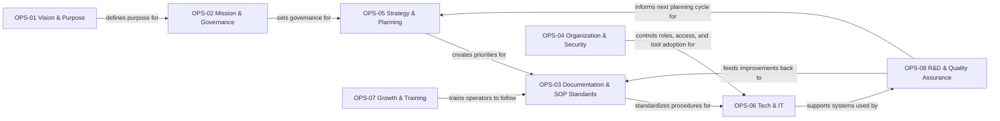
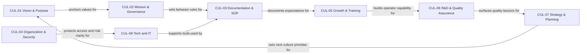
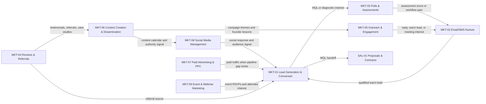
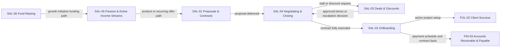
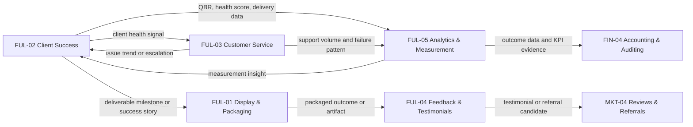
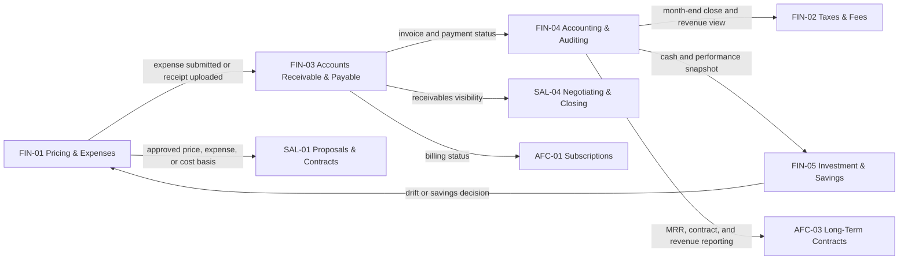
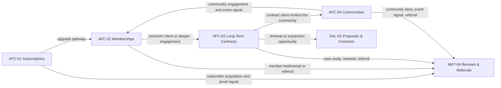
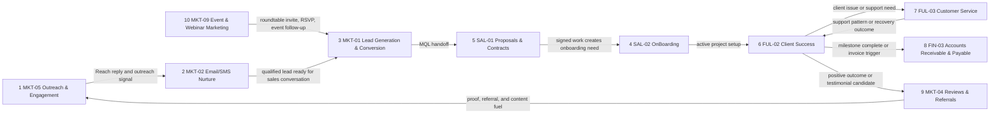

# URC Workflow Relationship Map

Date created: 2026-06-03
Status: v1 relationship map

## Purpose

This map shows how the 45 registered URC workflows relate within and across
departments. It is descriptive, not prescriptive: it documents the current
relationship logic from `docs/operations/workflow-registry.md`,
`docs/operations/agency-operating-manual.md`, and the imported workflow kits
without changing ownership, tools, or source-of-truth status.

Content queue health at creation: `healthy`.

## Executive Summary

The system has three relationship layers:

- Governance and operating support: `OPS-*` and `CUL-*` set direction,
  standards, security, training, tooling, planning, and quality expectations.
- Revenue spine: Marketing creates and qualifies demand, Sales converts it,
  Fulfillment delivers and measures outcomes, Finance controls invoice and
  accounting status, and AfterCare protects retention and expansion.
- Proof loop: Fulfillment and AfterCare outcomes return to Marketing through
  `MKT-04 Reviews & Referrals`, which feeds content, outreach, events, and
  future lead generation.

Main revenue path:

`MKT-06/MKT-05/MKT-01/MKT-02/MKT-03/MKT-09` -> `SAL-01/SAL-04/SAL-02` ->
`FUL-01/FUL-02/FUL-03/FUL-05` -> `FIN-03/FIN-04` ->
`AFC-01/AFC-02/AFC-03/AFC-04` -> `MKT-04`.

Review needed: several imported source kits still mention older or paid tool
stacks such as HubSpot, GoHighLevel, Stripe, ClickUp, Make, Zapier, or
QuickBooks. Those references are source context only until they are reconciled
against the current low-cost operating backbone: Reach, Gmail, Google Drive,
repo Markdown, the Independence Chapter CRM-lite bridge, owned finance
trackers/dashboards, and limited Notion dashboards.

## Full Cross-Department Map

```mermaid
graph LR
  OPS["OPS governance and operating standards"]
  CUL["CUL culture, training, security, QA"]
  MKT["Marketing demand and proof loops"]
  SAL["Sales proposals, closing, onboarding"]
  FUL["Fulfillment delivery and client success"]
  FIN["Finance pricing, AR/AP, close, reporting"]
  AFC["AfterCare retention, contracts, communities"]
  PROOF["Proof and referral loop"]

  OPS -->|"sets workflow standards, tool rules, planning cadence"| MKT
  OPS -->|"sets workflow standards, access, planning cadence"| SAL
  OPS -->|"sets delivery standards and QA expectations"| FUL
  OPS -->|"sets finance controls and review cadence"| FIN
  OPS -->|"sets retention operating standards"| AFC
  CUL -->|"sets values, training, AI policy, QA posture"| OPS
  CUL -->|"supports team behavior and documentation discipline"| MKT
  CUL -->|"supports account behavior and client trust"| SAL
  CUL -->|"supports delivery behavior and quality"| FUL
  CUL -->|"supports stewardship and review habits"| FIN
  CUL -->|"supports retention and community behavior"| AFC

  MKT -->|"MQL, diagnostic, roundtable, or beta interest"| SAL
  SAL -->|"signed proposal, onboarding packet, project kickoff"| FUL
  SAL -->|"contract terms, payment schedule, invoice need"| FIN
  FUL -->|"milestone complete, client health, support issue, outcome data"| FIN
  FUL -->|"delivery status, engagement, testimonials, case-study candidates"| AFC
  FIN -->|"invoice status, payment status, revenue reporting"| SAL
  FIN -->|"billing status, MRR, receivables, renewal visibility"| AFC
  AFC -->|"renewal, upgrade, contract, membership, community signal"| SAL
  AFC -->|"happy client, referral, testimonial, case-study signal"| PROOF
  FUL -->|"positive outcome, feedback, testimonial candidate"| PROOF
  PROOF -->|"reviews, referrals, case studies, content fuel"| MKT
```

## Department Maps

### Operations

`OPS-*` workflows govern the operating system. They are not a linear revenue
process; they create the rules that keep every department from drifting.

### Culture

`CUL-*` workflows mirror and reinforce the operating layer with values,
training, documentation behavior, security norms, and quality habits.

### Marketing

Marketing creates demand, qualifies interest, nurtures prospects, creates
events, and captures proof from delivery and aftercare.

Review needed: `MKT-09` is still a folder shell, so event follow-up
relationships should be confirmed when the roundtable workflow is built.

### Sales

Sales converts qualified demand into proposals, signed work, onboarding,
expansion offers, and future funding or product revenue decisions.

Review needed: older Sales source files may mention client portal or CRM
automation assumptions that must be reconciled against the current
Independence Chapter CRM-lite bridge, Gmail, and Google Drive operating path.

### Fulfillment

Fulfillment turns signed work into deliverables, health monitoring, support,
feedback, measurement, and renewal signals.

### Finance

Finance controls price, expense, invoice, payment, accounting, tax, savings,
and financial review visibility.

Review needed: imported finance sources may name Frappe, QuickBooks, or other
tools. URC does not currently have an active finance platform; owned finance
trackers and dashboards are the control layer until a replacement is chosen.

### AfterCare

AfterCare protects revenue after the sale through subscriptions, memberships,
long-term contracts, and communities.

Review needed: AfterCare source kits contain substantial older-platform
references. Treat the relationships as operational logic, not approved tool
selection.

## Cross-Department Handoff Table

| From | To | Trigger / Signal | Relationship Type | Owner Review Point | Source |
| --- | --- | --- | --- | --- | --- |
| `OPS-01` | `OPS-02`, `OPS-05` | Annual strategy session clarifies purpose | Governance dependency | Founder/CEO confirms purpose before governance or planning changes | Workflow registry |
| `OPS-03` | All workflow-owning departments | New workflow identified | SOP standard | Head of Operations reviews source of truth, trigger, owner, output, fallback | Workflow registry; agency manual |
| `OPS-04` | All workflow-owning departments | New hire, role change, or tool adoption | Access and role control | Founder/CEO confirms access, ownership, and security boundary | Workflow registry |
| `OPS-06` | All workflow-owning departments | Tool adoption or monthly review | Tool and system support | Head of Operations confirms tool fit and current low-cost backbone | Workflow registry; agency manual |
| `OPS-08` | All workflow-owning departments | Monthly QA cycle or R&D sprint | Quality and improvement loop | Head of Operations decides whether lesson becomes SOP or automation target | Workflow registry; agency manual |
| `CUL-03` | `OPS-03` | New workflow or quarterly audit | Documentation behavior support | Robert + SOP Owner confirm that culture guidance matches SOP standard | Workflow registry |
| `CUL-05` | `OPS-07` | New hire confirmed | Training support | Robert confirms operator can follow current workflow docs | Workflow registry |
| `CUL-06` | `OPS-08` | Monthly QA cycle or quarterly R&D sprint | Quality support | Robert confirms QA lesson is operationally useful before adoption | Workflow registry |
| `MKT-06` | `MKT-08`, `MKT-05`, `MKT-09` | Content calendar, trending topic, book or authority asset | Demand creation | Marcus + Robert confirm message lane and CTA | Workflow registry; agency manual |
| `MKT-08` | `MKT-01` | Social response or campaign signal | Lead capture | Marcus + Robert confirm whether signal becomes a lead | Workflow registry |
| `MKT-07` | `MKT-01` | Marketing calendar or pipeline gap | Paid lead capture | Marcus + Robert confirm budget, claim safety, and fit | Workflow registry |
| `MKT-09` | `MKT-01`, `MKT-02` | Event RSVP, attendee, or event follow-up window | Event lead capture and nurture | Robert + Marcus confirm roundtable path and follow-up | Workflow registry; agency manual; Review needed |
| `MKT-05` | `MKT-02` | Reply, warm lead, or outreach sequence result | Nurture enrollment | Marcus + Account Managers confirm stage and next step | Workflow registry; agency manual |
| `MKT-03` | `MKT-02`, `SAL-01` | Assessment score or workflow pain surfaced | Qualification support | Marcus + Robert confirm whether diagnostic result is sales-ready | Workflow registry |
| `MKT-02` | `MKT-01`, `SAL-01` | Lead becomes warm or ready for conversation | Qualification and handoff | Marcus + Robert confirm MQL status and stop conditions | Workflow registry; agency manual |
| `MKT-01` | `SAL-01` | MQL handoff from Marketing | Sales entry | Robert + Account Managers confirm fit, source, interest, and next action | Workflow registry |
| `SAL-01` | `SAL-04` | Proposal delivered | Close follow-up | Account Manager + Robert confirm proposal terms and follow-up stance | Workflow registry |
| `SAL-04` | `SAL-03` | Stall detected or discount requested | Pricing or concession review | Robert approves terms or escalation path | Workflow registry |
| `SAL-04` | `SAL-02` | Contract fully executed | Onboarding trigger | Account Manager assigned and kickoff path confirmed | Workflow registry |
| `SAL-02` | `FUL-02` | Client moved from signature to active project | Delivery activation | Account Manager confirms folder, packet, and first success checkpoint | Workflow registry; agency manual |
| `SAL-02` | `FIN-03` | Contract includes payment schedule or invoice need | Invoice setup | Robert + Finance confirm owned tracker invoice and receivables status | Workflow registry; agency manual |
| `SAL-05` | `MKT-06`, `MKT-01`, `SAL-01` | Passive or active income offer planning | Offer-to-market relationship | Robert confirms offer ladder, price, CTA, and source of truth | Workflow registry |
| `SAL-06` | `SAL-05`, `FIN-04` | Growth initiative or funding path | Growth funding support | Robert confirms whether fundraising supports current plan | Workflow registry |
| `FUL-01` | `FUL-04`, `MKT-04` | Deliverable milestone reached | Proof packaging | Account Manager + Marcus confirm outcome is shareable | Workflow registry |
| `FUL-02` | `FUL-03` | Client health issue or service need | Support trigger | Account Manager confirms issue owner and urgency | Workflow registry; agency manual |
| `FUL-02` | `FUL-05` | Daily health monitoring or QBR input | Measurement input | Account Manager confirms data is current and useful | Workflow registry |
| `FUL-03` | `FUL-05` | Inbound support volume or escalation pattern | Measurement and QA input | Account Manager + Robert confirm whether issue becomes SOP improvement | Workflow registry; agency manual |
| `FUL-04` | `MKT-04` | Feedback, testimonial, referral, or case study candidate | Proof loop | Marcus + Account Manager confirm permission and claim safety | Workflow registry |
| `FUL-05` | `FIN-04`, `MKT-04` | KPI evidence, delivered outcome, dashboard/report | Reporting and proof support | Robert + Operations Lead confirm metric is reliable | Workflow registry |
| `FIN-01` | `SAL-01`, `SAL-03` | Pricing, expense, cost, or discount concern | Pricing control | Robert confirms price and margin logic | Workflow registry |
| `FIN-03` | `SAL-04`, `AFC-01`, `AFC-03` | Invoice status, AP/AR status, payment schedule | Money-status visibility | Robert + Finance confirm owned tracker status before escalation | Workflow registry; agency manual |
| `FIN-04` | `FIN-02`, `FIN-05`, `AFC-03` | Month-end close and revenue reporting | Finance review and compliance | Robert confirms close, tax, savings, and contract reporting view | Workflow registry |
| `AFC-01` | `AFC-02` | Subscriber upgrade pathway or usage signal | Retention expansion | Account Manager + Robert confirm upgrade fit | Workflow registry |
| `AFC-02` | `AFC-03` | Premium member or deeper engagement need | Contract expansion | Jerome + Account Manager confirm contract path | Workflow registry |
| `AFC-03` | `SAL-01`, `FIN-03`, `FUL-02` | Signed proposal, renewal, or long-term contract event | Contract and renewal control | Jerome + Account Manager confirm terms, billing, and delivery obligations | Workflow registry; imported kits |
| `AFC-04` | `MKT-09`, `MKT-04`, `AFC-02` | New member joins platform or community activity | Community, event, proof, and membership loop | Marcus + Robert confirm event signal, member status, or shareable story | Workflow registry |
| `MKT-04` | `MKT-06`, `MKT-01`, `SAL-01` | Positive NPS, milestone, testimonial, referral | Proof and referral loop | Marcus + Robert confirm permission, claim safety, and next offer | Workflow registry; agency manual |

## Active Execution Queue Overlay

This overlay is the current implementation priority order from
`docs/operations/agency-operating-manual.md`. It does not replace the full
registry; it shows which relationships matter most while live outreach is
turning into revenue motion.

| Priority | Workflow | Relationship Focus | Current Mode | Next SOP / Automation Target |
| --- | --- | --- | --- | --- |
| 1 | `MKT-05 Outreach & Engagement` | Feeds replies and live lead signals into nurture and the Independence Chapter CRM-lite bridge | Manual / Reach-assisted | Outreach batch setup, tracking, and reply handling |
| 2 | `MKT-02 Email/SMS Nurture` | Keeps follow-up consistent after interest or replies arrive | Manual / scheduled campaigns | Nurture sequence rules, stop conditions, handoff rules |
| 3 | `MKT-01 Lead Generation & Conversion` | Qualifies and dedupes leads before Sales handoff | Manual CSV review | Lead qualification, dedupe, and bridge-tracker import |
| 4 | `SAL-02 OnBoarding` | Converts signed work into active client setup and delivery start | Zapier + manual gap | Google Drive packet copy, folder population, sharing |
| 5 | `SAL-01 Proposals & Contracts` | Turns revenue conversations into proposal and contract status | Manual / template-driven | Proposal prep, review, send, and status tracking |
| 6 | `FUL-02 Client Success` | Watches active client health and next actions | Manual | Client success tracker and check-in cadence |
| 7 | `FUL-03 Customer Service` | Triage layer for inbound questions and recovery work | Manual | Issue intake, tiering, and escalation |
| 8 | `FIN-03 Accounts Receivable & Payable` | Controls invoice and payment status visibility | Manual / owned finance tracker | Invoice creation, receivables review, payment status, SKU/account mapping |
| 9 | `MKT-04 Reviews & Referrals` | Converts outcomes into testimonials, referrals, and proof | Manual | Testimonial request, referral ask, proof capture |
| 10 | `MKT-09 Event & Webinar Marketing` | Builds the Bootstrapper Capital roundtable/event lane | Folder shell | Roundtable invite, RSVP, event follow-up |

## Coverage Check

All registered workflow IDs are represented in this map:

- Operations: `OPS-01`, `OPS-02`, `OPS-03`, `OPS-04`, `OPS-05`, `OPS-06`,
  `OPS-07`, `OPS-08`
- Culture: `CUL-01`, `CUL-02`, `CUL-03`, `CUL-04`, `CUL-05`, `CUL-06`,
  `CUL-07`, `CUL-08`
- Finance: `FIN-01`, `FIN-02`, `FIN-03`, `FIN-04`, `FIN-05`
- Sales: `SAL-01`, `SAL-02`, `SAL-03`, `SAL-04`, `SAL-05`, `SAL-06`
- Marketing: `MKT-01`, `MKT-02`, `MKT-03`, `MKT-04`, `MKT-05`, `MKT-06`,
  `MKT-07`, `MKT-08`, `MKT-09`
- Fulfillment: `FUL-01`, `FUL-02`, `FUL-03`, `FUL-04`, `FUL-05`
- AfterCare: `AFC-01`, `AFC-02`, `AFC-03`, `AFC-04`

## Maintenance Notes

- Update this map when the workflow registry changes, when an active queue
  workflow is certified, or when an SOP changes a cross-department handoff.
- Keep tool references conservative. If an imported kit names a paid or legacy
  platform, mark that relationship `Review needed` until the active operating
  backbone confirms the tool.
- Do not use this map as a substitute for the workflow kits. It is a navigation
  and dependency layer that points operators to the right workflow.
