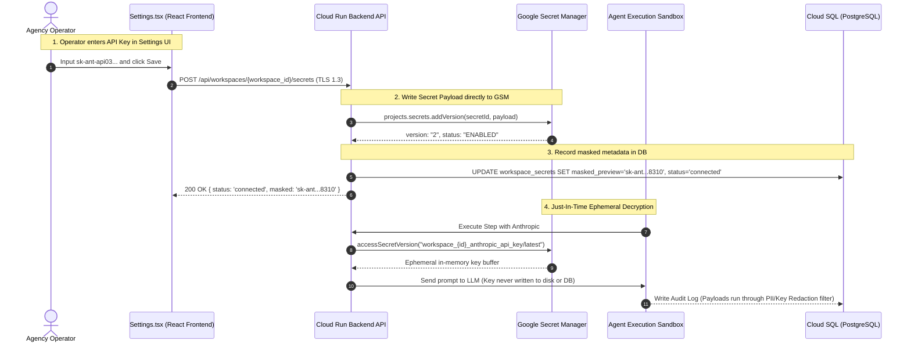

# AgentLab Multi-Tenant Secrets Architecture (Google Secret Manager)

## 1. Architectural Philosophy

In the AgentLab multi-tenant SaaS architecture on Google Cloud Platform (GCP), **third-party API credentials (OpenAI, Anthropic, Gemini, HubSpot, Apollo, Microsoft 365) are NEVER stored in plaintext or reversible columns within the primary PostgreSQL database.**

Storing credentials in relational tables introduces critical security vulnerabilities (e.g., database dump leaks, SQL injection exposure, unmasked audit logs). Instead, AgentLab delegates secret lifecycle management, versioning, and access control to **Google Secret Manager (GSM)**.

---

## 2. Resource Naming Convention

All workspace-scoped secrets follow a deterministic, namespace-isolated resource identifier pattern:

```text
projects/{GCP_PROJECT_ID}/secrets/workspace_{WORKSPACE_ID}_{PROVIDER_NAME}
```

### Standard Provider Keys:
| Provider / Tool | GSM Secret ID Pattern | Example Resource Path |
| :--- | :--- | :--- |
| **OpenAI** | `workspace_{id}_openai_api_key` | `projects/agentlab-prod/secrets/workspace_9b1e2_openai_api_key` |
| **Anthropic** | `workspace_{id}_anthropic_api_key` | `projects/agentlab-prod/secrets/workspace_9b1e2_anthropic_api_key` |
| **Google Vertex / AI** | `workspace_{id}_google_api_key` | `projects/agentlab-prod/secrets/workspace_9b1e2_google_api_key` |
| **HubSpot** | `workspace_{id}_hubspot_token` | `projects/agentlab-prod/secrets/workspace_9b1e2_hubspot_token` |
| **Apollo.io** | `workspace_{id}_apollo_api_key` | `projects/agentlab-prod/secrets/workspace_9b1e2_apollo_api_key` |
| **Microsoft 365** | `workspace_{id}_m365_client_secret` | `projects/agentlab-prod/secrets/workspace_9b1e2_m365_client_secret` |

---

## 3. Secret Metadata in PostgreSQL

While the secret payload lives exclusively inside Google Secret Manager, the PostgreSQL database maintains lightweight synchronization metadata inside a JSONB or metadata structure:

```json
{
  "provider": "openai",
  "gsm_secret_id": "workspace_9b1e2_openai_api_key",
  "version": "1",
  "masked_preview": "sk-proj-9921••••••••8941",
  "status": "connected",
  "last_rotated_at": "2026-08-22T10:45:00Z"
}
```

---

## 4. End-to-End Operational Lifecycle



---

## 5. Security & IAM Guardrails

1. **Least-Privilege Service Accounts**:
   - The Cloud Run agent execution backend runs under a dedicated service account:
     `agentlab-runtime@{PROJECT_ID}.iam.gserviceaccount.com`.
   - Granted `roles/secretmanager.secretAccessor` constrained strictly to the required secret resources.
2. **In-Memory Zero Retention**:
   - Decrypted credentials exist solely in heap memory during runtime model requests and are garbage-collected immediately following API response handling.
3. **Audit Log Scrubbing**:
   - The telemetry pipeline (`audit_logs`) passes all `payload_in` and `payload_out` JSON data through regex scrubbing filters that strip any token matching patterns like `sk-proj-*`, `sk-ant-*`, `AIzaSy*`, or `pat-na1-*`.
4. **Key Rotation & Destruction**:
   - Operators can rotate or destroy keys at any time via the Settings UI, which calls `projects.secrets.versions.destroy` on deprecated versions in GSM without requiring database schema migrations.
